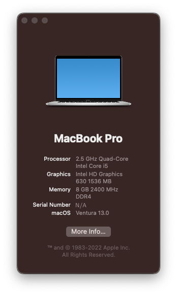

# [PARTIAL SUCCESS, [see progress](progress.md)] Acer-Nitro5-Hackintosh
(This is a fork from afkniladri, use his instead)

# macOS 13 beta (Ventura) : Beta 3

The project was made from scratch with the help of [Opencore - Dortania Guide](https://dortania.github.io/OpenCore-Install-Guide/). A huge thanks to the awesome community for the documantation.

'Opencore Version : 0.8.3'

## Contents

- [Configuration](#configuration)
- [Current Status](#current-status)
- [DSDT-SSDT](#dsdt-ssdt)
- [Credits](#credits)

## Configuration

| Specifications | Detail                                                  |
| ------------------- | ------------------------------------------- |
| Laptop Model  | Acer Nitro 5 2018 - AN515-51 |
| Processor           | Intel Core i5-7300HQ @ 2.5GHz, with turbo on @ 3.5GHz  |
| Memory              | 8G of RAM (Unknown Manufacter, would have to check) |
| Storage         | Intel SSD 600p Series (256GB)         |
| Graphics        | Dedicated GTX 1050ti & Internal Intel (U)HD 630         |
| Display       | Internal FHD 1920x1080 (15.6 inch)     |
| Sound Card          | Realtek ALC255                             |
| Wireless Card       | Intel AC-7265 Dualband (Qualcomm Atheros QCA61x4A [NFA344A HAI])         |
| Touchpad            | Synaptics I2C HID based                              |

## Current Status (More details [here](progress.md))
- **Qualcomm Atheros Wifi cards** are not natively supported so it is better to replace it with a wifi dongle, or a different supported card. (NFA344A HAI)
- **Discrete graphic card** never going to work! (At least not yet https://www.reddit.com/r/hackintosh/comments/uxz95u/nvidia_web_drivers_running_on_macos_monterey/ )
- **Touchpad Gestures** works after adding patched DSDT/SSDT (XOSI) in OC (You'll have to change settings in MacOS)
- **Sound** Works perfectly with Layout 31 and ComboJack for headset.
- **HDMI** Won't work, since the port is hardwired to the dGpu (disabled).
- **Everything else works** 

## DSDT-SSDT
- Custom DSDT/SSDT files for this particular model has been created using dumping the DSDT from Windows 10 and then modifying it for MacOS to work.

> ***Note*** : Please don't use this if you're using a different model, it will definitely cause problems.

> **Another Note** : Use GenSMBIOS to generate new serial, don't use the one included in the config provided.

## Credits

- **Special thanks** to [Acidanthera](https://github.com/acidanthera) for providing [AppleALC](https://github.com/acidanthera/AppleALC), [AppleSupportPkg](https://github.com/acidanthera/AppleSupportPkg), [HibernationFixup](https://github.com/acidanthera/HibernationFixup), [Lilu](https://github.com/acidanthera/Lilu), [OpenCorePkg](https://github.com/acidanthera/OpenCorePkg), [VirtualSMC](https://github.com/acidanthera/VirtualSMC), [VoodooPS2](https://github.com/acidanthera/VoodooPS2), and [WhateverGreen](https://github.com/acidanthera/WhateverGreen).
- Thanks to [RehabMan](https://github.com/RehabMan) for providing [SATA-unsupported](https://github.com/RehabMan/hack-tools/tree/master/kexts/SATA-unsupported.kext).
- Thanks to [VoodooI2C](https://github.com/VoodooI2C) for providing [VoodooI2C](https://github.com/VoodooI2C/VoodooI2C).
- Thanks to [hackintosh-stuff](https://github.com/hackintosh-stuff) for providing [ComboJackFix](https://github.com/hackintosh-stuff/ComboJack).
- Thanks to [chris1111](https://github.com/chris1111) for providing the [Wireless USB Driver](https://github.com/chris1111/Wireless-USB-Big-Sur-Adapter).
- A huge thanks to the opencore community, I couldn't stress enough the support I got to make this a success. [Reddit](https://www.reddit.com/r/hackintosh/)
